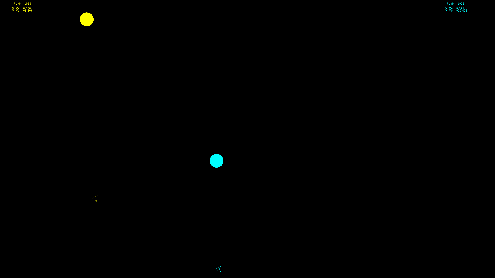

# GravityShips2.o

A lunar-lander duel for one player against an offline computer opponent, or two players on the same keyboard. Two ships, one gravity well, one tank of fuel each. You grab your ball, land on your pad, and score. First to five wins, and the loser's ship blows up.

This is a native Linux (Wayland/X11) rewrite of **GravityShips**, a game Terry McGuinness wrote in Xcode on macOS in 2015.



---

## Gameplay

Each ship (yellow = Player 1, cyan = Player 2) has:

- **A ball** in its own colour, placed at random. Drift into it *slowly*. It only counts if your speed is under the capture threshold.
- **A landing pad** in its own colour. After you pick up your ball, the pad moves somewhere new. Land on it squarely to score: level attitude, near-zero velocity, both feet on the deck.
- **Fuel.** Thrust and rotation both burn it. Sitting on your own pad refuels you. When the tank is empty, the engine only coughs.

Each point makes the game harder. Your ball and your pad both get smaller, and from stage 2 on the pad floats off the ground. The ships collide with each other using a Newtonian impulse model — equal masses exchanging momentum, with a restitution coefficient (set by a ship's damage) spanning a clean elastic rebound to an energy-absorbing inelastic one — and they bounce off each other's pads. The world wraps around horizontally. The ground is hard.

The first player to **5 points** wins. The loser goes out as a "red giant": a white flash and twin shockwaves, a spray of sparks, and hull pieces that tumble down to the ground. Then a small seed of fire cools from white to deep red as it slowly grows into a breathing, counter-rotating cloud with flickering corona rays and rising embers.

### Controls

At startup, use **Up/Down** to choose **Single-player** (the default) or
**Two-player**, then **Enter** to start. No gameplay advances in the menu.
The start screen is drawn in a glowing vector-arcade stroke font: the title
letters drop in under gravity and thud as they bounce into place, the two
ships orbit the title, and a hovering ship marks your choice.
In single-player you fly yellow, and the computer flies cyan; Player 2's
keyboard controls are ignored.

| | Player 1 (yellow) | Player 2 (cyan) |
|---|---|---|
| Rotate CCW | `Q` | `[` |
| Rotate CW | `W` | `]` |
| Thrust | `X` | `/` |
| Fire | `Z` or `C` | `.` or `Right Shift` |

`Esc` quits from the menu or the match. Restart the application for another match.

### Computer opponent

The CPU starts **Easy**. If it falls one point behind, it gradually moves toward
**Normal**; two or more points behind moves it toward **Hard**. It eases back
as it catches up, returning toward Easy at a tie or ahead. A full Easy-to-Hard
transition takes 180 physics frames (three seconds). The cyan HUD shows the
effective level; `+` or `-` indicates an upward or downward transition.

The CPU flies with human-like key timing. It cannot feather the controls with
single-frame pulses: on Easy every thrust burst lasts at least 6 frames (0.1 s),
every rotation tap at least 5, and it pauses 9 frames before counter-rotating.
Those limits only tighten as it falls behind, down to 2-frame bursts and taps
on Hard, and it keeps its hands off the keys in the last instant before
touchdown. Tuning lives in `ai_tuning` in `src/ship.h`.

The CPU collects its ball, brakes for pickup, approaches its pad from above,
lands, and returns for fuel and ammunition. It can also attack, evade incoming
ships/pellets, or block an opponent's delivery approach. Combat commitments are
limited so it returns to scoring. Harder levels increase safe cruise speed,
combat opportunities, and firing frequency/precision; landing safety stays the
same. There are no extra resources, teleports, or special physics advantages.

This version is entirely **offline**: no API key, network connection, or API
charges. Goal selection is separate from the per-frame flight controller to
allow an optional Jev strategy integration later; Jev is not implemented here.

### Pellet gun

Each ship fires small pellets from its nose. They leave at muzzle speed plus the ship's own velocity, fall under gravity, and give the shooter a little recoil. A hit knocks the target back and spins it, harder the further off-centre the hit is. That's enough to spoil a landing or push someone off their pad. Pellets stop dead on either landing pad.

- **Magazine:** 6 rounds, shown as `Ammo: ooo...` under the fuel readout. Sitting on your own pad reloads one round every ¾ s, at the same time as refuelling.
- **Salvage:** spent pellets lie on the ground for 15 s, dimmed. Any ship that flies over one with room in its magazine picks it up, including the enemy's.

### Sound

All the sound is synthesised in real time. There are no sample files. Each sound is panned left or right to follow its ship, and each ship has its own pitch. In single-player, the computer's engine and ship sounds play at half volume so your own ship stands out. Shared sounds (game start, victory, explosion) stay at full volume.

| Event | Sound |
|---|---|
| Thrust | Low rocket rumble with flutter; pitch rises with throttle |
| Rotate | Puffing thruster hiss; CW and CCW sound different |
| Out of fuel | Dry engine cough |
| Low fuel (< 15%) | Two-tone warning beeps |
| Ground / pad-top impact | Thud with falling pitch; louder the harder you hit |
| Clean landing | Rising bell arpeggio |
| Refuelling | Bubble blips that rise in pitch as the tank fills |
| Pad-side scrape | Metallic clank |
| Ship-on-ship | Two-hull clang |
| Ball pickup | Upward zip |
| Point scored | Four-note jingle |
| Hitting the other player's ball | Boing |
| Fire | Pneumatic pop |
| Fire with empty magazine | Dry click |
| Pellet hits a ship | High metallic ping |
| Round reloaded / salvaged | Ratchet tick that rises in pitch as the magazine fills |
| Victory | Long explosion with crackle and sub-bass, plus a brass fanfare |
| Game start | Power-up sweep |

---

## Building

### Dependencies

Arch / Omarchy:

```sh
sudo pacman -S --needed base-devel cmake pkgconf mesa glfw
```

Debian / Ubuntu: `build-essential cmake pkg-config libgl-dev libglfw3-dev`. Fedora: `gcc-c++ cmake pkgconf mesa-libGL-devel glfw-devel`.

Audio is loaded at runtime through miniaudio's `dlopen` backends (PipeWire → PulseAudio → ALSA), so no audio dev packages are needed. If no device is found, the game runs silent.

### Build and run

```sh
cmake -S . -B build
cmake --build build -j
./build/gravityships
```

The build defaults to `Release`. The binary finds `assets/` relative to its own path via `/proc/self/exe`, so you can launch it from any directory. It opens fullscreen on the primary monitor at the monitor's native mode.

### Tests

CMake enables lightweight CTest executables by default (`-DBUILD_TESTING=OFF`
builds just the game and its shared core).

```sh
cmake -S . -B build
cmake --build build -j
ctest --test-dir build -L unit --output-on-failure
ctest --test-dir build -L graphics --output-on-failure
```

Unit tests exercise strategy and controller calculations without a window.
Graphics scenarios need a working GLFW/OpenGL display: they use a hidden
window and the actual ship controls, physics, collisions, resources, and
scoring. A missing display is an explicit test failure. On an X11 CI machine
with Xvfb installed, use
`xvfb-run -a ctest --test-dir build -L graphics --output-on-failure`.
Xvfb is optional test infrastructure, not a game dependency.

The scenario runner checks 20 fixed seeds per score stage and difficulty,
requiring at least 18 deliveries per group within 18,000 frames each. It also
checks complete matches, wrapped travel, raised/narrow pads, spin recovery,
target changes, fuel/reload behavior, combat, and terminal controls. Timing
samples exclude rendering and require p99 AI work below 1 ms on the machine
running the test. To see scenario summaries and timing, run
`./build/ai_scenarios`; `./build/ai_scenarios 2` is a smaller development sweep.
Automated scenarios do not replace checking fullscreen controls, HUD, sound,
and both modes interactively.

---

## Project layout

```
CMakeLists.txt
assets/cloud.jpg        explosion texture (actually a 100x100 RGBA PNG)
src/main.cpp            window, startup menu, input, game loop, 60 Hz pacing
src/gameplay.{h,cpp}    shared initialization, stage progression, scoring
src/ai.{h,cpp}          offline strategy, adaptive difficulty, flight controller
src/ship.{h,cpp}        ship physics, collisions, landing, drawing, HUD text
src/sound.{h,cpp}       procedural audio synth (miniaudio device, lock-free event queue)
src/vectorfont.{h,cpp}  glowing stroke font for the start screen
tests/                  controller unit tests and actual-physics scenarios
third_party/            stb_image.h, stb_easy_font.h, miniaudio.h (single-header, vendored)
```

### Technical notes

- **Rendering:** fixed-function OpenGL 1.x in immediate mode, exactly as in the original, running in a GLFW compatibility-profile context. Mesa and GLVND supply `libGL`.
- **Timing:** the physics is integrated once per frame with fixed constants. That was tuned against a 60 Hz display in 2015, so the loop is capped at 60 Hz with a sleep-to-deadline limiter, plus resync if it falls more than 100 ms behind. On a 144 Hz panel the game plays at its original speed.
- **AI:** copied observations are captured before player input. Strategy is
  reconsidered every 20 frames, or immediately when invalidated or threatened;
  flight control runs every frame on the game thread. Heading comes from the
  rotated nose geometry, while `Ship::ang` is angular velocity. AI tuning lives
  in `ai_tuning` in `src/ship.h`; no worker accesses live ships or audio.
- **Audio:**
  - Everything runs on the miniaudio callback thread at 48 kHz, f32 stereo.
  - The game thread posts events through a single-producer/single-consumer ring buffer. Continuous engine state (thrust and rotation per ship) is published through relaxed atomics, and the synth smooths it into envelopes.
  - Each one-shot event has a per-ship cooldown so that contact sounds don't retrigger every frame.
  - Up to 32 voices, with oldest-voice stealing, then equal-power panning and a `tanh` soft clip on the mix.
- **Tuning knobs in `src/sound.cpp`:** per-event gains (the `* 0.xx` factors in `render()` and `renderEngine()`), `kDur` for how long each sound lasts, and `kCooldown` for the minimum gap between repeats.

---

## History

### The original: GravityShips (2015, macOS / Xcode)

Source: <https://github.com/TerryMcGuinness/GravityShips>

- **Author:** Terry McGuinness. `ship.h` / `ship.cpp` / `main.cpp` are headed *"Created by Terrence McGuinness on 3/14/15."*
- **Build:** an Xcode project, started from the scaffolding of Tom Dalling's [*Modern OpenGL* tutorial series](https://github.com/tomdalling/opengl-series) (Apache 2.0). The repo still carries that series' multi-platform skeleton: `platforms/{osx,linux,windows,ios}` and `source/common/platform.hpp`.
- **Libraries:**
  - GLFW 3 (a macOS static `libglfw3.a`) for the window and input.
  - GLEW and GLM, both included but essentially unused.
  - GLUT for bitmap-font HUD text.
  - SOIL for loading the explosion texture.
  - **AudioToolbox** `AudioServicesPlayAlertSound()`, which played macOS system alert sounds on thrust, rotation, bounces, landing and refuelling.
  - An `SDL2.framework` sat in the tree, unused.
- **Design:** everything is in the code, including the stage-based difficulty ramp, fuel economy, landing tolerances, bounce behaviour, texture-rotating explosion cloud, and the stat and score layout. All of it carries over unchanged here.
- **The repo:** it spent years out of version control. It was re-established on GitHub on 2025-08-03 (`22df3b9` *"Re-established repo for Gravity Ships"*, followed by `37bb003` *"testing update"*). Its README is still Tom Dalling's tutorial README, inherited from the scaffold.

### The rewrite: GravityShips2.o (2026, Linux)

This repo is a clean, standalone port that builds only against system libraries on a current Linux desktop (developed on Omarchy / Arch, Hyprland, Wayland). The game logic, physics constants and look are Terry's original. The changes are confined to the platform layer, plus a handful of latent bug fixes.

**Platform layer**

- Build: Xcode is replaced by a ~25-line CMake project. The macOS-only static libs, GLEW, GLM, GLUT, SOIL, SDL2 and `platform.hpp`/`platform_osx.mm` are all removed.
- Windowing and input: the system GLFW 3.4+ (native Wayland).
- Texture loading: SOIL → `stb_image` v2.30, with vertical flip on load.
- HUD text: `glutBitmapCharacter` → `stb_easy_font` quads. Text is positioned in the original 800×600 virtual layout and scaled with the display height.
- Asset lookup: NSBundle → an executable-relative path via `/proc/self/exe`.
- Frame pacing: a 60 Hz limiter, so the per-frame physics runs at the designed speed on any refresh rate.

**Sound, redesigned from scratch**

- The macOS system alert beeps are replaced by the procedural synthesiser in `src/sound.cpp`, built on miniaudio.
- The engine sounds are continuous and follow the controls, rather than retriggered beeps.
- New events: low-fuel alarm, ball pickup, scoring, victory fanfare, and a proper explosion.

**Bug fixes found during the port**

- `drawText` read back `GL_PROJECTION_MATRIX` as if it were a matrix mode, which is an invalid enum. It also leaked a `new double[16]` on every call. It now pushes and pops the projection and modelview matrices correctly.
- The explosion bound a hard-coded texture id `1`. It now uses the id OpenGL actually returns, and disables `GL_TEXTURE_2D` afterwards.
- `landedOnPad`, `onPad`, `hitOtherBall`, `pointWasInPolygon` and `rotateCloud` were never initialised. They are now zeroed in `Ship::reset()`.

---

## Credits

- **Game design and original implementation:** Terry McGuinness (2015).
- **Linux port and refactor:** GitHub Copilot (Claude Opuse 5.5), working with Terry McGuinness (2026). That covers the build system, the platform layer, the procedural sound engine and the bug fixes, all done single-shot.
- Original project scaffold: Tom Dalling, [opengl-series](https://github.com/tomdalling/opengl-series) (Apache 2.0).
- Vendored libraries:
  - [stb_image / stb_easy_font](https://github.com/nothings/stb) by Sean Barrett (public domain / MIT).
  - [miniaudio](https://github.com/mackron/miniaudio) by David Reid (public domain / MIT-0).
  - [GLFW](https://www.glfw.org/) (zlib), linked from the system.
